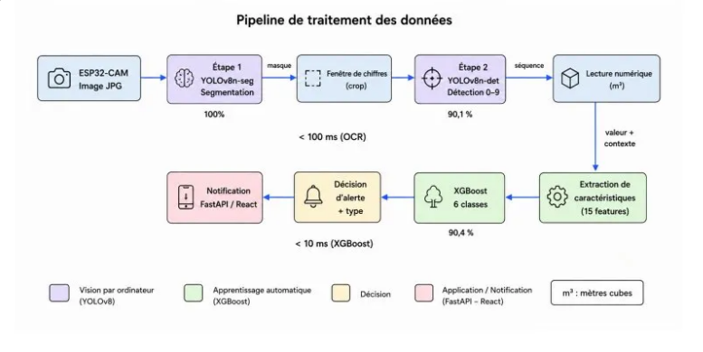
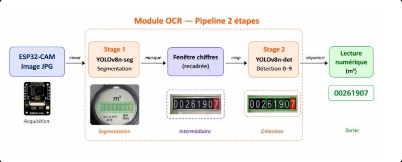
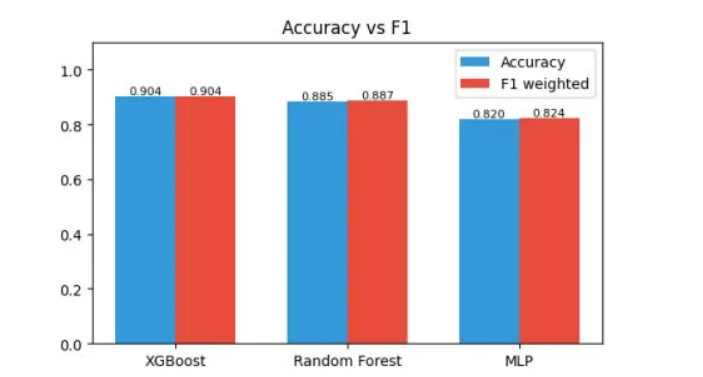

# AquaSense — Surveillance Intelligente de l'Eau

# AquaSense — Surveillance Intelligente de l'Eau


Application mobile de surveillance intelligente des compteurs d'eau avec détection d'anomalies par IA.

## 🏠 Description

AquaSense est une application IoT + IA qui permet de :
- Surveiller sa consommation d'eau en temps réel
- Détecter les anomalies de consommation (fuites, surconsommation)
- Recevoir des alertes intelligentes
- Analyser l'historique de consommation
- Configurer des seuils personnalisés par type de bâtiment

  
## 📱 Aperçu de l'Application

| Login | Dashboard | Alertes | Profil |
|-------|-----------|---------|--------|
|  |  |  |  |


## 📋 Prérequis

- **Python** : 3.11+
- **Node.js** : 18+
- **npm** : 9+

## 🚀 Installation

### Frontend (React + Vite)

```bash
# Installer les dépendances
npm install

# Lancer le serveur de développement
npm run dev
```

L'application sera disponible sur : `http://localhost:5173`

### Backend (FastAPI)

```bash
# Aller dans le dossier backend
cd aquasense-backend

# Installer les dépendances Python
py -3.11 -m pip install -r requirements.txt

# Lancer le serveur API
py -3.11 -m uvicorn main:app --reload --host 127.0.0.1 --port 8000
```

L'API sera disponible sur : `http://127.0.0.1:8000`
- Documentation Swagger : `http://127.0.0.1:8000/docs`

## 🤖 Modèles IA 

### Vue d'ensemble du pipeline complet



Le pipeline se divise en deux branches :
- **OCR** (< 100 ms) : lecture des m³ depuis la caméra
- **XGBoost** (< 10 ms) : classification de l'anomalie en 6 classes

---

### Module OCR — 2 étapes

La lecture des chiffres se fait en deux passes YOLOv8 successives :



| Étape | Modèle | Rôle |
|-------|--------|------|
| Stage 1 | `best.pt` (YOLOv8n-seg) | Segmentation — isole la fenêtre de chiffres |
| Stage 2 | `best.pt` (YOLOv8n-det) | Détection 0–9 — lit chaque chiffre |

---

### Détection d'anomalies — XGBoost



XGBoost atteint **90,4 % d'accuracy** et un **F1-score de 0,904**, le meilleur des trois modèles testés.
Il classe chaque relevé en **6 catégories** : `normal`, `surconsommation`, `fuite_nocturne`, `anomalie_saisonniere`, `pic_inhabituel`, `conso_nulle`.

---

### Fichiers requis

Pour activer la détection d'anomalies par IA, placer les fichiers suivants dans `aquasense-backend/ai_models/` :

| Fichier | Description |
|---------|-------------|
| `best.pt` | Modèle YOLOv8 pour la détection de chiffres |
| `best_model.pkl` | Modèle XGBoost pour la classification d'anomalies |
| `scaler.pkl` | Scaler pour la normalisation des données |
| `le_building.pkl` | LabelEncoder pour les types de bâtiments |
| `le_season.pkl` | LabelEncoder pour les saisons |
| `metadata.json` | Métadonnées du modèle |

> **Note :** Sans ces fichiers, le système utilise des seuils heuristiques.

## 👤 Compte de Test

```
Email : demo@aquasense.tn
Mot de passe : password123
```

## 📁 Structure du Projet

```
AquaSense Mobile App Prototype/
├── src/                          # Frontend React
│   ├── api/                      # Appels API
│   │   ├── auth.ts              # Authentification
│   │   ├── users.ts             # Gestion utilisateurs
│   │   ├── readings.ts          # Relevés de consommation
│   │   └── alerts.ts            # Alertes
│   ├── app/
│   │   ├── components/
│   │   │   ├── screens/         # Écrans de l'app
│   │   │   │   ├── LoginScreen.tsx
│   │   │   │   ├── RegisterScreen.tsx
│   │   │   │   ├── DashboardScreen.tsx
│   │   │   │   ├── ProfileScreen.tsx
│   │   │   │   ├── AlertsScreen.tsx
│   │   │   │   └── ...
│   │   │   └── ui/              # Composants UI (shadcn)
│   │   └── routes.tsx           # Routes React Router
│   └── styles/                  # CSS, Tailwind
│
├── aquasense-backend/           # Backend FastAPI
│   ├── routes/                  # Endpoints API
│   │   ├── auth.py              # /auth/login, /auth/register
│   │   ├── users.py             # /users/{id}
│   │   ├── readings.py          # /readings/*
│   │   ├── alerts.py            # /alerts/*
│   │   └── settings_api.py      # /settings/*
│   ├── models/                  # Modèles IA
│   │   ├── anomaly.py           # Détection d'anomalies
│   │   └── yolo_ocr.py          # OCR YOLO
│   ├── services/                # Logique métier
│   ├── database.py              # SQLAlchemy + SQLite
│   ├── main.py                  # Point d'entrée FastAPI
│   └── requirements.txt         # Dépendances Python
│
├── package.json                 # Dépendances npm
├── vite.config.ts               # Configuration Vite
└── README.md                    # Ce fichier
```

## 🛠️ Technologies

| Catégorie | Technologie |
|-----------|-------------|
| **Frontend** | React 18, TypeScript, Vite, Tailwind CSS, Recharts |
| **Backend** | FastAPI, Python 3.11, SQLAlchemy, SQLite |
| **IA/ML** | YOLOv8 (OCR), XGBoost (classification), EasyOCR |
| **Auth** | JWT (python-jose), bcrypt |
| **API** | REST, OpenAPI/Swagger |

## 📊 Seuils de Consommation (m³/h)

| Type de bâtiment | Normal | Alerte |
|------------------|--------|--------|
| Maison | 0.013| 0.018 |
| Appartement | 0.009 | 0.0.013 |
| Cafe| 0.045 | 0.065|
| Restaurant | 0.090 | 0.130 |
| Hotel | 0.250 | 0.375|
| Immeuble | 0.120 | 0.175|
| Usine | 0.4 | 0.6 |

## 🔧 Commandes Utiles

```bash
# Lancer les deux serveurs
# Terminal 1 : Frontend
npm run dev

# Terminal 2 : Backend
cd aquasense-backend
py -3.11 -m uvicorn main:app --reload --port 8000

# Réinitialiser la base de données
Remove-Item -Path "aquasense-backend/data/aquasense.db" -Force
```

## 📝 Licence

Projet prototype — AquaSense
  
